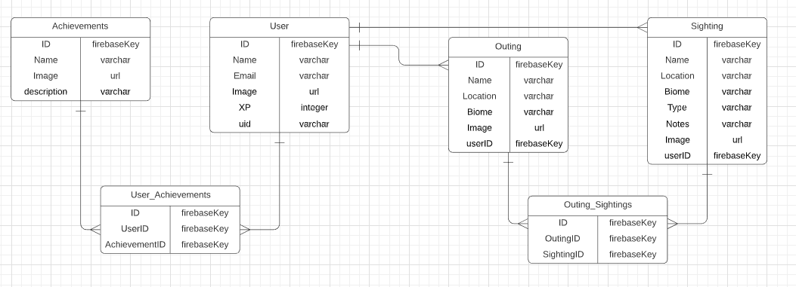

# Gnophy

## Motivation
Named for the ancient Greek “Gnosis” (personal knowledge) and “Physis” (nature), Gnophy is an app built to encourage kids to learn about the nature around them via experience. The user can add Outings on which they will catalogue Sightings of the flora, fauna, and fungi that they encounter. From there, the user can input information about their own personal experience with what they encountered. Users can view all Sightings on a particular Outing or all Sightings as whole, as well as filter Sightings by type (flora, fauna, fungi). While adding Sightings, users will level up and unlock achievements as a way to motivate a continued journey of discovery.

The idea for this app came to me while I was out on one of my own daily walks admiring the nature in my neighborhood I thought about how little I knew about the specific pieces of nature I was admiring and about my own love of creating my own etymological and mythological systems as a child. Gnophy will allow the user to tailor their use of the app to learn more about nature or to build their own worlds by ascribing their own meaning to that which they encounter, strengthening the link between learning and imagination.

I am excited about the prospect of building this app because it will allow me to experiment in a user experience space with which I am unfamiliar, that of designing with children in mind. I also look forward to exploring the use of gamification to promote positive habits as I myself have seen the positive effects that such design tactics can have through my own use of two apps which lean heavily on the concept, Duolingo (learning new languages) and Noom (managing calorie consumption).

## Planning
- [Figma](https://www.figma.com/file/hWzcLhr02oMvVBbYAX6rwH/GNOPHY?node-id=0%3A1)
- [LucidChart ERD](https://lucid.app/lucidchart/invitations/accept/1b3b35d2-821b-4843-9f39-c1be7ed772eb)
- [Issue Tickets](https://github.com/michaelpfohl/ec13-capstone-gnophy/projects)
- [Mock Data generated with Mockaroo](https://www.mockaroo.com/466f9bc0)

## Wireframe

## ERD


## Example Data
```json
Sighting

"-MMxTRQql-IivX_TYljn":
  {
    "id":"-MI7-6yd-fBLLhUfy7E3",
    "name":"Eastern indigo snake",
    "location":"Kilifi",
    "biome":"Swamp",
    "type":"Fauna",
    "notes":"Drymarchon corias couperi",
    "image":"http://dummyimage.com/300x300.bmp/5fa2dd/ffffff",
    "userId":"-MI7-943U4tiUDQ9oqyr",
  },
```


